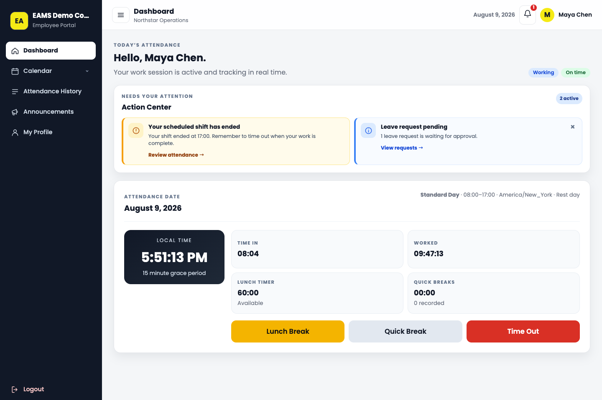
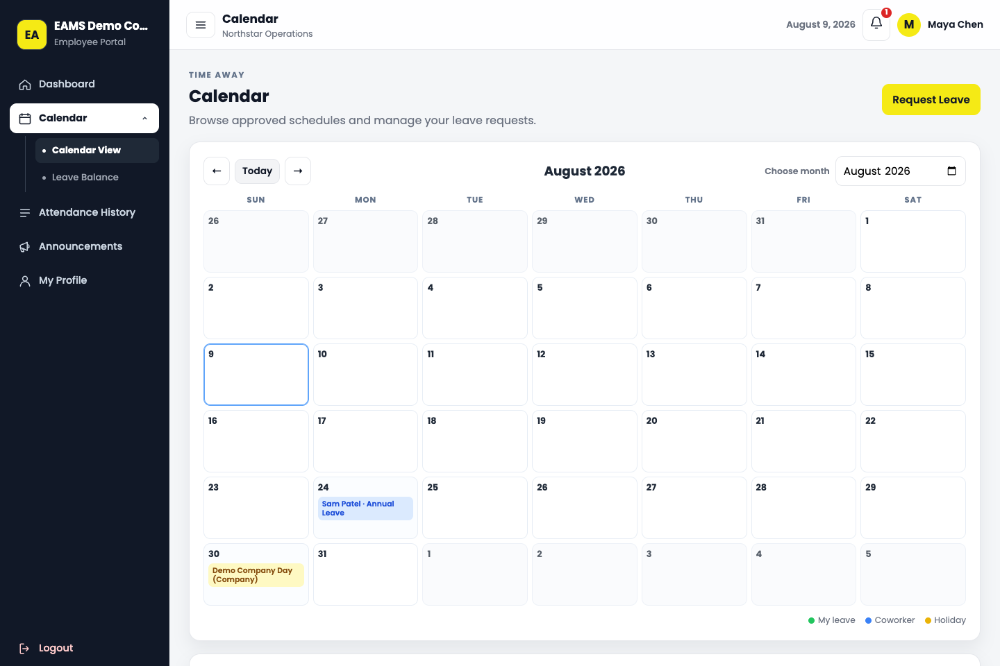
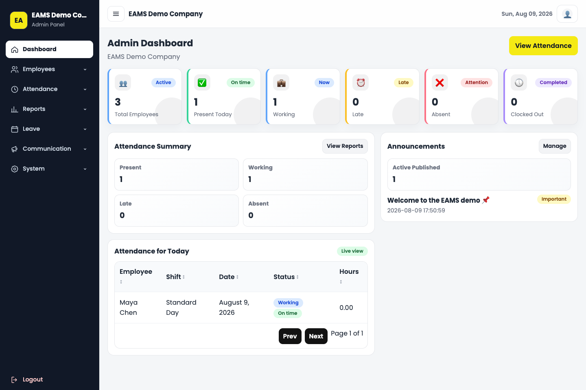
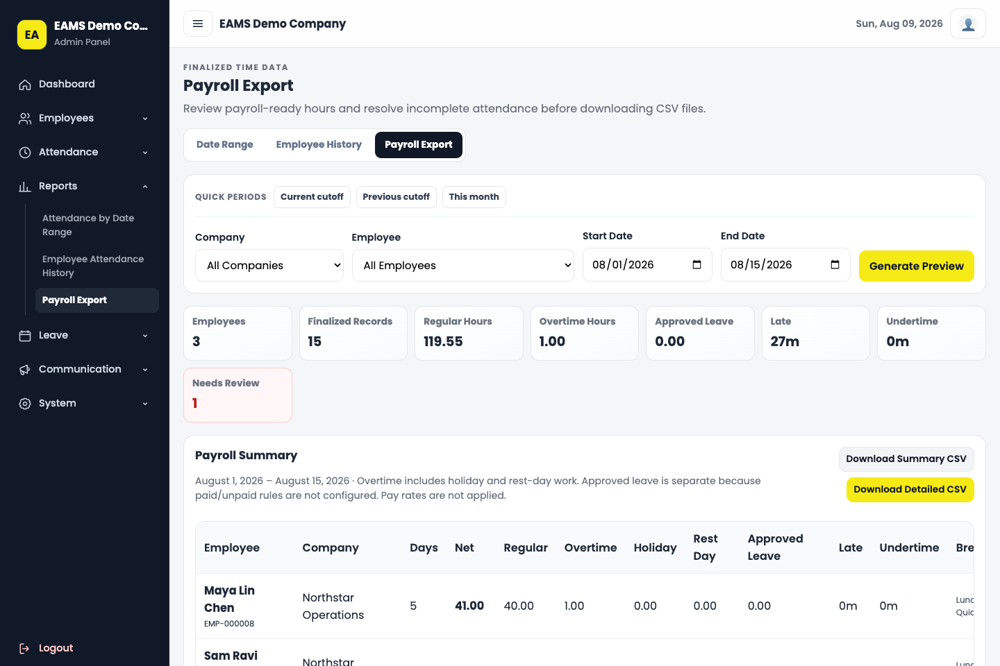
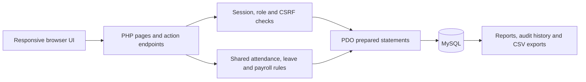

# Employee Attendance Management System

[](https://github.com/nagackc/employee-attendance-management-system/actions/workflows/ci.yml)


EAMS is a role-based web application for turning everyday attendance records into useful operational workflows. Employees can manage attendance, breaks, leave, notifications, and correction requests; administrators can manage schedules, approvals, audit history, reports, and payroll-ready exports.

This project is presented as a product and engineering case study. All screenshots and optional seed records use fictional people and organizations.

## Product tour

| Employee workspace | Leave planning |
| --- | --- |
|  |  |

| Administrative overview | Payroll readiness |
| --- | --- |
|  |  |

## What the system handles

- Separate employee and administrator experiences with database-backed role and account-status checks.
- Clock-in, lunch, paid quick breaks, clock-out, overnight shifts, and stale-session safeguards.
- Employee correction requests for incorrect or missing attendance, with an administrator review trail.
- Day- and hour-based leave requests, balances, adjustments, holidays, and team availability.
- Payroll-ready regular, overtime, holiday, rest-day, late, undertime, lunch, and quick-break summaries.
- Finalized-only CSV exports with incomplete records separated into a review queue.
- Targeted announcements, employee notifications, company schedules, and configurable branding.
- Audited administrative changes, archival voiding, and employee deactivation that preserves history.

## Engineering highlights

- PDO prepared statements and transactional updates protect multi-step business workflows.
- CSRF protection, strict session cookies, login throttling, and session-user revalidation cover authentication-sensitive actions.
- Database constraints prevent duplicate active attendance, overlapping open quick breaks, and duplicate pending corrections.
- Historical shift snapshots keep old reports stable when schedule settings change.
- CSV cells are neutralized against spreadsheet-formula injection.
- Logo uploads are limited by size, MIME type, actual image content, randomized filenames, and managed-path cleanup rules.
- Migrations are idempotent and preserve legacy attendance dates, overnight records, and related history.

## Architecture



The application intentionally uses server-rendered PHP and lightweight JavaScript. Shared helpers contain authentication, scheduling, attendance, leave, payroll, notification, audit, and upload rules; page controllers coordinate those rules with role-specific views.

## Technology

- PHP 8.3, PDO, and PHP sessions
- MySQL 5.7+ with foreign keys, generated columns, indexes, and transactions
- HTML, CSS, and vanilla JavaScript
- Composer scripts for repeatable project commands
- GitHub Actions with a disposable MySQL service

## Local setup

### Requirements

- PHP 8.3 with `curl`, `dom`, `fileinfo`, `gd`, `mbstring`, and `pdo_mysql`
- MySQL 5.7 or newer (CI uses MySQL 8.0)
- Composer 2
- Node.js for JavaScript syntax validation

### 1. Configure the database

Create an empty MySQL database, then either copy the local configuration template:

```bash
cp config/database.example.php config/database.local.php
```

or provide environment variables:

```bash
export EAMS_DB_HOST=127.0.0.1
export EAMS_DB_PORT=3306
export EAMS_DB_SOCKET='' # Optional: set this to a local MySQL socket path instead of TCP.
export EAMS_DB_NAME=eams
export EAMS_DB_USER=eams_user
export EAMS_DB_PASS='replace-with-a-local-password'
```

Legacy `FJ_DB_*` variables remain supported temporarily, but new environments should use `EAMS_DB_*`.

### 2. Create the first administrator

The installer is CLI-only and does not contain a default password.

```bash
export EAMS_ADMIN_EMAIL=admin@example.test
export EAMS_ADMIN_PASSWORD='replace-with-at-least-12-characters'
export EAMS_ADMIN_COMPANY='Example Company'
composer install-app
composer migrate
```

Both commands are safe to run again. Migrations report that already-applied changes are current.

### 3. Run locally

Point Apache at the project directory or use PHP's development server:

```bash
php -S 127.0.0.1:8080
```

Open `http://127.0.0.1:8080` and sign in with the administrator credentials supplied during installation.

## Fictional demo data

Demo seeding resets application records and is deliberately restricted to a disposable database containing only `@example.test` accounts. Both safety flags must identify that database exactly.

```bash
export EAMS_ALLOW_DEMO_SEED=1
export EAMS_DEMO_DATABASE_NAME=eams_demo
export EAMS_DEMO_PASSWORD='local-demo-password-2026'
composer seed-demo
```

The seed creates fictional employees, schedules, attendance, breaks, leave, a holiday, an announcement, a notification, and a correction request. It prints the fictional login emails; the password is the value supplied through `EAMS_DEMO_PASSWORD`.

Never point the demo seeder at a production or personal-data database.

## Verification

Run the static and database-independent checks:

```bash
composer check
```

After installing and migrating a disposable test database, run the transaction-wrapped integration suite:

```bash
export EAMS_TEST_DATABASE_NAME=eams_test # Must exactly match EAMS_DB_NAME.
composer test:integration
```

GitHub Actions performs PHP linting, JavaScript validation, a fresh installation, two migration passes, helper assertions, and database integration tests for every push and pull request.

## Technical decisions

- **Preserve instead of delete:** attendance is voided with a reason and employees are deactivated, retaining reporting and audit history.
- **Snapshot schedule context:** attendance keeps the timezone and shift details used on that day so later configuration changes do not rewrite history.
- **Separate payroll readiness from payroll:** the system calculates worked-time categories and identifies exceptions but does not calculate wages, taxes, or statutory premiums.
- **Keep deployment simple:** server-rendered pages and local assets fit shared-hosting and MAMP-style environments without hiding business rules behind framework abstractions.
- **Treat demo data as disposable:** fictional records are reproducible, isolated, and blocked from databases containing non-demo employee accounts.

## Current limitations

- There is no hosted public demo; the portfolio uses sanitized screenshots and reproducible local data.
- Payroll exports provide time classifications, not compensation or jurisdiction-specific payroll calculations.
- Uploaded branding uses local disk storage rather than object storage.
- Automated browser coverage is limited to authenticated smoke checks; the integration suite focuses on business and data integrity rules.

## What I learned

Building EAMS required treating time tracking as more than CRUD: overnight boundaries, incomplete sessions, paid and unpaid breaks, historical schedules, leave charges, and export safety all affect one another. The most useful design improvement was to make those relationships explicit in database constraints, transactional workflows, and repeatable tests instead of relying only on UI validation.

## Portfolio context

EAMS is the first substantial case study in a stack-neutral software-development portfolio. Future projects may use different technologies; this repository remains evidence of finishing, securing, documenting, and testing a practical application.

No open-source license has been granted for this repository at this time.
